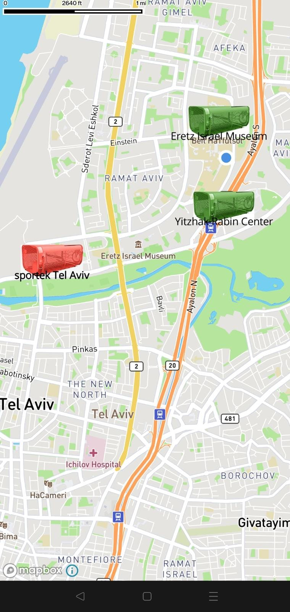

# LockoBike
An android app create as a solution for bicycle theft problem in Tel Aviv. 
There are servel containers spread across the city, each of them is able to protect certain amount of bikes.
# Launching Screen

## Map View
The app is showing the users the locations of the containers , their current capabillity and marks the full containers with red color
and green for avalibale ones.

## Patient UI
## Doctor UI
### Doctor Waiting List Screen
A screen that shows patients waiting list with all pending appointments. The appointments are sorted by arrival time (the time they added to firebase).

## Patient UI
### Doctors List Screen
A screen that shows doctors list. There is an option to filter by availability.

 

### Patient Waiting List Screen
A screen that shows patients waiting list with all pending appointments to the same doctor. The appointments are sorted by arrival time (the time they added to firebase).# MoveoApp

Android appointment management app for doctors and patients.

## Screenshots

### Login and Sign Up screens

Authentication was performed using firebase authentication and the personal data was saved using firebase firestore.

 

## Doctor UI

### Doctor Waiting List Screen

A screen that shows patients waiting list with all pending appointments. The appointments are sorted by arrival time (the time they added to firebase).

## Patient UI

### Doctors List Screen

A screen that shows doctors list. There is an option to filter by availability.

 

 There is an option to cancel an appointment.

